# Magic8‑Companion

*Intelligent orchestration layer for 0‑DTE combo type selection & position risk management*

> **Status**: Implementation Ready (v1.1, June 7 2025)


---

## ✨ What is Magic8‑Companion?

Magic8‑Companion is a **companion system** that works alongside the existing **Magic8** prediction system to provide:

🎯 **Smart Combo Type Selection** — Analyzes Magic8's 5‑minute predictions and recommends which 0‑DTE option combo type (Iron Condor, Butterfly, or Vertical) is most favorable at scheduled checkpoints

🚨 **Intelligent Risk Management** — Monitors open positions and generates exit signals when market conditions turn adverse

**Key Design Principles:**
* **Companion, not Clone** — Works WITH Magic8, doesn't replace it
* **Wrapper‑first** — Minimal custom logic, maximum use of proven systems
* **Focused scope** — Does combo type selection and risk management only
* **Ship‑fast** — Deploy in ≤ 7 days as single Docker service

---

## 🔄 How It Works

```mermaid
flowchart LR
    A[Magic8<br/>5-min Predictions] --> B[Magic8‑Companion]
    C[IB Portfolio<br/>Position Data] --> B
    B --> D[Combo Type<br/>Recommendation]
    B --> E[Exit Signal<br/>Generation]
    D --> F[Discord Alerts]
    E --> F
```



**At Scheduled Checkpoints** (10:30, 11:00, 12:30, 14:45 ET):
1. **Consume** latest Magic8 prediction (trend, range, example trades)
2. **Score** which combo type is most favorable based on market conditions
3. **Recommend** highest-scoring combo type via Discord alerts

**Continuously Monitor** open positions:
1. **Track** positions via IB Portfolio API
2. **Check** exit triggers (position drift, range shifts, trend reversals)
3. **Alert** immediately when exit conditions are met

---

## 🚀 Features

### Combo Type Intelligence
* **Butterfly Favorability** — Detects when price is pinned near center with tight ranges
* **Iron Condor Timing** — Identifies range-bound, neutral market conditions  
* **Vertical Opportunities** — Recognizes strong directional trends with wide ranges
* **Confidence Scoring** — Only recommends when score ≥ 70 and clearly best option

### Risk Management
* **Position Drift Detection** — Alerts when spot moves >75% of profit zone
* **Range Shift Monitoring** — Exits when Magic8's predicted range no longer favorable
* **Trend Reversal Alerts** — Closes directional trades on trend changes
* **Loss Limit Enforcement** — Circuit breaker at $2k per position, $5k daily

### Integration & Alerts
* **Magic8 Data Parsing** — Flexible integration (file, HTTP, WebSocket)
* **IB Portfolio Sync** — Real-time position tracking and P&L monitoring
* **Discord Notifications** — Instant alerts with clear action recommendations
* **Scheduled Execution** — Precise checkpoint timing with timezone handling

---

## 🏗️ Architecture

| Component | Technology | Purpose |
|-----------|------------|----------|
| **Magic8 Integration** | File I/O / HTTP / WebSocket | Consume Magic8 predictions |
| **Position Tracking** | `ib_async` | IB portfolio synchronization |
| **Combo Scoring** | Custom Python logic | Type favorability algorithms |
| **Risk Monitoring** | Custom Python logic | Exit signal generation |
| **Scheduling** | `APScheduler` | Checkpoint execution |
| **Alerts** | Discord webhooks | Instant notifications |
| **Data Storage** | SQLite | Position tracking database |
| **Configuration** | `pydantic-settings` | Environment-based config |

---

## ⚙️ Prerequisites

* **Magic8 System** — Running and producing 5-minute predictions
* **Interactive Brokers** — TWS or IB Gateway (paper trading recommended)
* **Discord Webhook** — For receiving alerts
* **Docker & Docker Compose** — For containerized deployment
* **Python ≥ 3.11** — If running outside Docker

---

## 🔧 Quick Start

### 1. Clone & Configure
```bash
git clone https://github.com/birddograbbit/Magic8-Companion.git
cd Magic8-Companion

# Setup environment
cp .env.example .env
nano .env  # Configure paths and credentials
```

### 2. Environment Configuration
```env
# Magic8 Integration
MAGIC8_SOURCE=file  # file, http, or websocket
MAGIC8_FILE_PATH=/path/to/magic8/output.json
MAGIC8_POLL_INTERVAL=30

# Interactive Brokers
IB_HOST=127.0.0.1
IB_PORT=7497
IB_CLIENT_ID=2

# Alerts
DISCORD_WEBHOOK=https://discord.com/api/webhooks/your-webhook-url

# Risk Limits
MAX_DAILY_LOSS=5000
MAX_POSITION_LOSS=2000

# Timezone
TZ=America/New_York
```

### 3. Deploy
```bash
# Start the system
docker-compose up -d

# Monitor activity
docker-compose logs -f magic8_companion
```

### 4. Verify Operation
Check Discord for checkpoint alerts like:
```
🎯 Magic8-Companion Checkpoint 10:30 ET
SPX: $5,848.66
Recommendation: IRON CONDOR (Score: 78)
Magic8 Range: 5850-5860, Strength: 0.53
Rationale: Range-bound market, neutral trend strength
```

---

## 📅 Scheduled Operation

**Daily Checkpoints** (Eastern Time):
* **10:30 AM** — Morning market assessment
* **11:00 AM** — Post-opening stability check  
* **12:30 PM** — Midday momentum evaluation
* **02:45 PM** — Pre-close positioning

**Continuous Monitoring**:
* Position tracking every 60 seconds
* Exit signal evaluation in real-time
* Discord alerts within 30 seconds of trigger

---

## 📊 Sample Alerts

### Combo Type Recommendation
```
🎯 CHECKPOINT ALERT 🎯
Time: 10:30 ET | SPX: $5,848.66

RECOMMENDATION: BUTTERFLY (Score: 85)
Confidence: HIGH

Market Analysis:
• Range: 5850-5860 (tight)
• Trend Strength: 0.53 (neutral)
• Center Distance: 0.3% (pinning likely)

Magic8 Data:
• Predicted Close: 5849.52
• Call Level: 5900
• Put Level: 5850
```

### Exit Signal
```
🚨 EXIT SIGNAL 🚨
Position: Iron Condor 5890/5910/5780/5770

TRIGGER: Position Drift
Current SPX: 5920 (approaching short call)
Unrealized P&L: -$1,240

ACTION REQUIRED: Close position immediately
Reason: Spot within 2% of short call strike
```

---

## 🧪 Testing

### Unit Tests
```bash
# Run test suite
pytest tests/ -v

# Test specific module
pytest tests/test_combo_scorer.py -v
```

### Integration Testing
```bash
# Simulate Magic8 data
echo '{"spot_price": 5850, "trend": "Up", "strength": 0.75}' > data/magic8_test.json

# Test checkpoint execution
python -m magic8_companion.test_checkpoint
```

---

## 🛣️ Development Roadmap

### Phase 1: Core Implementation (Week 1)
- [x] Magic8 data integration
- [x] Combo type scoring logic
- [x] Position tracking system
- [x] Discord alerting
- [x] Scheduled execution

### Phase 2: Enhancements (Week 2-3)
- [ ] WebSocket Magic8 integration
- [ ] Advanced exit signal algorithms
- [ ] Historical performance tracking
- [ ] Strategy backtesting module

### Phase 3: Platform Evolution (Month 2)
- [ ] Web dashboard interface
- [ ] Multiple broker support
- [ ] ML-enhanced scoring models
- [ ] Multi-timeframe analysis

---

## 🤝 Contributing

We welcome contributions! Please:

1. **Open an issue** for major changes
2. **Follow the wrapper-first principle** — extend, don't modify core systems
3. **Include tests** for new functionality
4. **Update documentation** as needed

---

## 📄 License

MIT © 2025 Magic8‑Companion contributors

---

## 🆘 Support

* **Documentation**: See `/docs` folder for detailed implementation guides
* **Issues**: GitHub Issues for bug reports and feature requests
* **Discussions**: GitHub Discussions for questions and ideas

*Built to enhance Magic8's capabilities with systematic combo type selection and disciplined risk management.*
