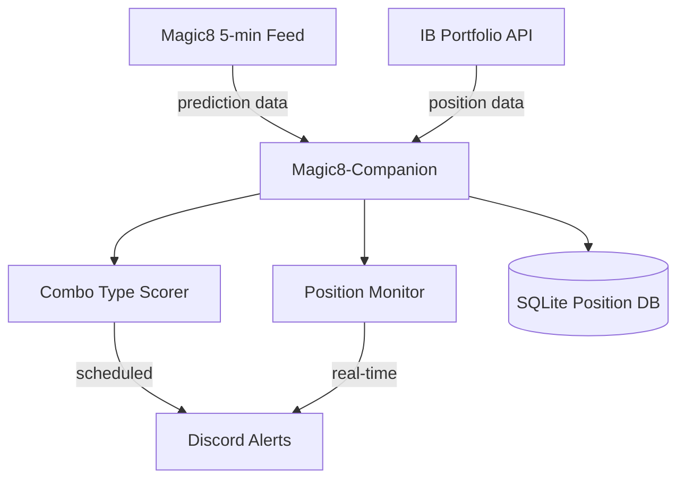

# Magic8‑Companion — Implementation Guide

*Version 1.1 – June 7 2025*

---

## 0  Purpose & Scope

This guide provides **exactly** how to build the **Magic8‑Companion**: a focused orchestration system that consumes Magic8's 5‑minute predictions and provides two core functions:

1. **Combo Type Recommendation** — At scheduled checkpoints (10:30, 11:00, 12:30, 14:45 ET), analyze Magic8's recommendations and determine which 0‑DTE option combo type is most favorable
2. **Exit Signal Generation** — Monitor open positions and alert when market conditions turn adverse

**Key Principles:**
- **Wrapper‑first** — Orchestrate around Magic8 and IB API; build minimal custom logic
- **Core‑only** — Focus solely on combo type selection and risk management  
- **Ship‑fast** — Deploy as single service in ≤ 7 trading days

**What Magic8‑Companion Does NOT Do:**
- Calculate Greeks or gamma exposure (Magic8 provides this)
- Form specific option combos (Magic8 provides strikes/prices)
- Predict trends or ranges (Magic8 provides this)
- Execute trades continuously (scheduled checkpoints only)

---

## 1  High‑Level Architecture



**Data Flow:**
1. **Consume** Magic8's 5‑minute predictions (trend, range, example trades)
2. **Score** which combo type (Butterfly/Iron Condor/Vertical) is most favorable
3. **Track** open positions via IB Portfolio API
4. **Monitor** positions against exit triggers
5. **Alert** via Discord when conditions change

---

## 2  Magic8 Integration Specification

### 2.1 Magic8 Data Format
Based on the sample output, Magic8 provides:

```json
{
  "timestamp": "2025-05-22T11:41:19",
  "spot_price": 5848.66,
  "trend": "Up",
  "predicted_close": 5849.52,
  "strength": 0.53,
  "range": 10.0,
  "targets": [5850.0, 5860.0],
  "levels": {
    "calls": 5900.0,
    "puts": 5850.0,
    "center": 5875.0,
    "delta": 5846.21,
    "gamma": 5861.65,
    "interest": 5831.99
  },
  "example_trades": {
    "butterfly": {
      "strikes": "5905/5855/5805",
      "type": "CALL",
      "price": 24.82,
      "action": "BUY"
    },
    "iron_condor": {
      "strikes": "5905/5910/5780/5775", 
      "type": "CALL/PUT",
      "price": 0.43,
      "action": "SELL"
    },
    "vertical": {
      "strikes": "5820/5815",
      "type": "PUT", 
      "price": 0.9,
      "action": "SELL"
    }
  }
}
```

### 2.2 Magic8 Integration Methods

**Option A: File Polling** (Recommended for MVP)
```python
# Check for new Magic8 output file every 30 seconds
magic8_file = "/path/to/magic8/output.json"
```

**Option B: HTTP API** (If available)
```python
# Poll Magic8 REST endpoint
magic8_url = "https://magic8.api/latest"
```

**Option C: WebSocket Feed** (Future enhancement)
```python
# Real-time Magic8 predictions
magic8_ws = "wss://magic8.feed/predictions"
```

---

## 3  Component Stack (Minimal)

| Layer               | Technology              | Purpose                           |
| ------------------- | ----------------------- | --------------------------------- |
| Magic8 Integration  | `requests` / file I/O   | Consume Magic8 predictions        |
| Portfolio Data      | `ib_async`              | Track open positions              |
| Combo Scoring       | Custom Python module    | Type favorability logic           |
| Position Monitoring | Custom Python module    | Exit signal generation            |
| Alerts              | `discord.py`            | Notifications                     |
| Persistence         | SQLite                  | Position tracking DB              |
| Scheduling          | `APScheduler`           | Checkpoint execution              |

---

## 4  Combo Type Scoring Logic

### 4.1 Scoring Matrix

Based on Magic8's prediction data, score each combo type:

```python
def score_combo_types(magic8_data):
    """Score Butterfly, Iron Condor, Vertical based on Magic8 data"""
    
    spot = magic8_data['spot_price']
    trend_strength = magic8_data['strength']
    range_size = magic8_data['range']
    center = magic8_data['levels']['center']
    
    scores = {}
    
    # Butterfly: Favor when spot near center, low range
    butterfly_score = 0
    if abs(spot - center) / spot < 0.005:  # Within 0.5%
        butterfly_score += 30
    if range_size < 15:  # Tight range
        butterfly_score += 25
    if trend_strength < 0.6:  # Weak trend
        butterfly_score += 20
    
    # Iron Condor: Favor when range-bound, neutral
    condor_score = 0
    if range_size < 20:  # Range-bound
        condor_score += 35
    if trend_strength < 0.7:  # Not strongly directional
        condor_score += 30
    if 0.4 <= trend_strength <= 0.6:  # Neutral zone
        condor_score += 15
    
    # Vertical: Favor when strong trend, wide range
    vertical_score = 0
    if trend_strength > 0.6:  # Strong trend
        vertical_score += 40
    if range_size > 15:  # Expecting movement
        vertical_score += 25
    
    scores = {
        'butterfly': min(butterfly_score, 100),
        'iron_condor': min(condor_score, 100), 
        'vertical': min(vertical_score, 100)
    }
    
    return scores
```

### 4.2 Recommendation Threshold

Only recommend if score ≥ 70 and clearly best option:

```python
def generate_recommendation(scores):
    """Generate combo type recommendation"""
    best_combo = max(scores, key=scores.get)
    best_score = scores[best_combo]
    
    # Must score >= 70 and be 15+ points ahead
    if best_score >= 70:
        second_best = sorted(scores.values())[-2]
        if best_score - second_best >= 15:
            return {
                'recommendation': best_combo,
                'score': best_score,
                'confidence': 'HIGH' if best_score >= 85 else 'MEDIUM'
            }
    
    return {'recommendation': 'NONE', 'reason': 'No clear favorite'}
```

---

## 5  Exit Signal Logic

Monitor positions and trigger exits when:

### 5.1 Exit Triggers

```python
def check_exit_signals(position, magic8_data):
    """Check if position should be exited"""
    
    spot = magic8_data['spot_price']
    predicted_range = magic8_data['targets']
    
    exit_signals = []
    
    # 1. Position drift beyond profit zone
    if position['type'] == 'butterfly':
        center_strike = position['center_strike']
        wing_width = position['wing_width']
        
        distance_from_center = abs(spot - center_strike)
        if distance_from_center > (wing_width * 0.75):
            exit_signals.append({
                'trigger': 'POSITION_DRIFT', 
                'reason': f'Spot {spot} > 75% from center {center_strike}'
            })
    
    elif position['type'] == 'iron_condor':
        short_put = position['short_put_strike']
        short_call = position['short_call_strike']
        
        if spot <= short_put * 1.02 or spot >= short_call * 0.98:
            exit_signals.append({
                'trigger': 'POSITION_DRIFT',
                'reason': f'Spot {spot} approaching short strikes'
            })
    
    # 2. Magic8 range no longer favorable
    if position['type'] == 'butterfly':
        if not (predicted_range[0] <= position['center_strike'] <= predicted_range[1]):
            exit_signals.append({
                'trigger': 'RANGE_SHIFT',
                'reason': f"Predicted range {predicted_range} excludes center {position['center_strike']}"
            })
    
    # 3. Trend reversal for directional trades
    if position['type'] == 'vertical':
        position_direction = position['direction']  # 'bull' or 'bear'
        magic8_trend = magic8_data['trend'].lower()
        
        if (position_direction == 'bull' and magic8_trend == 'down') or \
           (position_direction == 'bear' and magic8_trend == 'up'):
            exit_signals.append({
                'trigger': 'TREND_REVERSAL',
                'reason': f"Position {position_direction} vs Magic8 {magic8_trend}"
            })
    
    # 4. Circuit breakers
    if position['unrealized_pnl'] <= -2000:  # $2k loss limit per position
        exit_signals.append({
            'trigger': 'LOSS_LIMIT',
            'reason': f"Loss ${abs(position['unrealized_pnl'])} exceeds limit"
        })
    
    return exit_signals
```

---

## 6  Scheduled Execution Framework

### 6.1 Checkpoint Schedule

```python
from apscheduler.schedulers.asyncio import AsyncIOScheduler
from datetime import datetime
import pytz

def setup_scheduler():
    """Setup scheduled checkpoints"""
    
    scheduler = AsyncIOScheduler()
    est = pytz.timezone('America/New_York')
    
    # Schedule checkpoint functions
    scheduler.add_job(
        run_checkpoint,
        'cron',
        hour=10, minute=30,
        timezone=est,
        id='checkpoint_1030'
    )
    
    scheduler.add_job(
        run_checkpoint,
        'cron', 
        hour=11, minute=0,
        timezone=est,
        id='checkpoint_1100'
    )
    
    scheduler.add_job(
        run_checkpoint,
        'cron',
        hour=12, minute=30, 
        timezone=est,
        id='checkpoint_1230'
    )
    
    scheduler.add_job(
        run_checkpoint,
        'cron',
        hour=14, minute=45,
        timezone=est,
        id='checkpoint_1445'
    )
    
    return scheduler

async def run_checkpoint():
    """Execute scheduled checkpoint logic"""
    
    # 1. Get latest Magic8 prediction
    magic8_data = await get_latest_magic8_data()
    
    # 2. Check current positions
    positions = await get_current_positions()
    
    if positions:
        # Monitor existing positions for exit signals
        await check_position_exits(positions, magic8_data)
    else:
        # Generate new combo type recommendation  
        await generate_combo_recommendation(magic8_data)
```

---

## 7  Position Tracking

### 7.1 Position Data Structure

```python
# positions.db (SQLite)
CREATE TABLE positions (
    id INTEGER PRIMARY KEY,
    symbol TEXT NOT NULL,
    combo_type TEXT NOT NULL,  -- 'butterfly', 'iron_condor', 'vertical'
    direction TEXT,            -- 'bull', 'bear', 'neutral'
    entry_time TIMESTAMP,
    center_strike REAL,
    wing_width REAL,
    short_put_strike REAL,
    short_call_strike REAL,
    entry_credit REAL,
    max_loss REAL,
    current_pnl REAL,
    status TEXT DEFAULT 'OPEN'  -- 'OPEN', 'CLOSED', 'MONITORING'
);
```

### 7.2 Position Sync

```python
async def sync_positions_with_ib():
    """Sync position DB with IB portfolio"""
    
    ib_positions = await ib_client.get_positions()
    db_positions = get_db_positions()
    
    for ib_pos in ib_positions:
        if is_option_combo(ib_pos):
            update_position_pnl(ib_pos)
    
    # Mark closed positions
    for db_pos in db_positions:
        if not position_exists_in_ib(db_pos):
            mark_position_closed(db_pos)
```

---

## 8  Project Layout (Simplified)

```
magic8_companion/
├── main.py                 # Main orchestrator
├── config.py              # Configuration management
├── modules/
│   ├── magic8_client.py    # Magic8 integration
│   ├── combo_scorer.py     # Type scoring logic
│   ├── position_monitor.py # Exit signal generation
│   ├── ib_client.py        # IB portfolio integration
│   └── alert_manager.py    # Discord notifications
├── utils/
│   ├── db_client.py        # SQLite operations
│   └── scheduler.py        # Checkpoint scheduling
├── data/
│   └── positions.db        # SQLite database
├── tests/
│   └── test_*.py           # Unit tests
├── docker-compose.yml
├── requirements.txt
└── .env.example
```

---

## 9  Infrastructure (Minimal)

### 9.1 Docker Compose

```yaml
version: '3.8'

services:
  magic8_companion:
    build: .
    environment:
      - MAGIC8_SOURCE=${MAGIC8_SOURCE:-file}
      - MAGIC8_FILE_PATH=${MAGIC8_FILE_PATH:-/data/magic8_output.json}
      - IB_HOST=${IB_HOST:-host.docker.internal}
      - IB_PORT=${IB_PORT:-7497}
      - DISCORD_WEBHOOK=${DISCORD_WEBHOOK}
      - TZ=America/New_York
    volumes:
      - ./data:/app/data
      - ${MAGIC8_DATA_PATH}:/data
    depends_on:
      - health_check

  health_check:
    image: busybox
    command: sleep 5
```

### 9.2 Configuration

```python
# config.py
from pydantic_settings import BaseSettings

class Settings(BaseSettings):
    # Magic8 Integration
    magic8_source: str = "file"  # "file", "http", "websocket"
    magic8_file_path: str = "/data/magic8_output.json"
    magic8_url: str = ""
    magic8_poll_interval: int = 30  # seconds
    
    # IB Connection
    ib_host: str = "127.0.0.1"
    ib_port: int = 7497
    ib_client_id: int = 2
    
    # Alerts
    discord_webhook: str = ""
    
    # Risk Limits
    max_daily_loss: float = 5000
    max_position_loss: float = 2000
    
    # Scoring Thresholds
    min_recommendation_score: int = 70
    min_score_gap: int = 15
    
    class Config:
        env_file = ".env"

settings = Settings()
```

---

## 10  Development Timeline (7 Days)

| Day | Deliverable | Details |
|-----|-------------|---------|
| 1 | Setup & Magic8 Integration | Docker setup, Magic8 file parsing |
| 2 | Combo Type Scoring Logic | Implement scoring matrix |
| 3 | Position Tracking | SQLite DB, IB integration |
| 4 | Exit Signal Logic | Position monitoring, triggers |
| 5 | Scheduled Execution | APScheduler, checkpoint logic |
| 6 | Alerts & Testing | Discord integration, unit tests |
| 7 | Integration Testing | End-to-end validation |

---

## 11  Quick Start

### 11.1 Prerequisites

- Magic8 system running and outputting predictions
- IB TWS or Gateway running (paper trading)
- Docker & Docker Compose

### 11.2 Setup

```bash
# Clone repository
git clone https://github.com/birddograbbit/Magic8-Companion.git
cd Magic8-Companion

# Configure environment
cp .env.example .env
nano .env  # Set MAGIC8_FILE_PATH, DISCORD_WEBHOOK, etc.

# Start system
docker-compose up -d

# Monitor logs
docker-compose logs -f magic8_companion
```

### 11.3 Testing

```bash
# Simulate Magic8 data
echo '{"spot_price": 5850, "trend": "Up", "strength": 0.75, "range": 12}' > data/magic8_output.json

# Check recommendations in Discord channel
# Verify position tracking in logs
```

---

## 12  Example Discord Alerts

**Combo Type Recommendation:**
```
🎯 Magic8-Companion Checkpoint 10:30 ET
SPX: $5,848.66
Recommendation: IRON CONDOR (Score: 78)
Magic8 Range: 5850-5860, Strength: 0.53
Rationale: Range-bound market, neutral trend strength
```

**Exit Signal:**
```
🚨 EXIT SIGNAL - Butterfly Position
Center: 5875, Current: 5820
Trigger: POSITION_DRIFT (spot >75% from center)
Unrealized P&L: -$1,240
Action Required: Close position immediately
```

---

## 13  Key Success Metrics

- **Checkpoint Execution**: All 4 daily checkpoints execute successfully
- **Alert Latency**: Recommendations delivered within 60 seconds  
- **Position Tracking**: 100% sync with IB portfolio
- **Exit Signal Accuracy**: No false positives for 5 consecutive sessions

---

**This implementation guide provides a focused, achievable path to deploy Magic8-Companion as a complementary system that enhances Magic8's capabilities with systematic combo type recommendations and disciplined risk management.**
